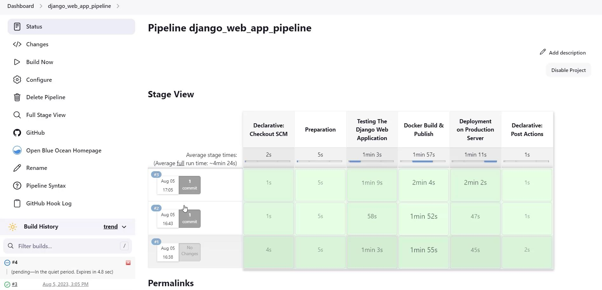
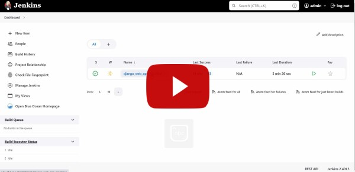

<!-- PROJECT SHIELDS -->
<!--
*** I'm using markdown "reference style" links for readability.
*** Reference links are enclosed in brackets [ ] instead of parentheses ( ).
*** See the bottom of this document for the declaration of the reference variables
*** for contributors-url, forks-url, etc. This is an optional, concise syntax you may use.
*** https://www.markdownguide.org/basic-syntax/#reference-style-links
-->

[![LinkedIn][linkedin-shield]][linkedin-url]

<!-- PROJECT LOGO -->
 

    

  <h3 align="center">Jenkins CI/CD Pipeline For Django Web Application</h3>

<!-- TABLE OF CONTENTS -->

  
Table of Contents

  <ol>
    <li><a href="#about-the-project">About The Project</a></li>
    <li><a href="#preview-video">Preview Video</a></li>
    <li><a href="#contact">Contact</a></li>
  </ol>

<!-- ABOUT THE PROJECT -->
## About The Project

* Project Name: Jenkins CI/CD Pipeline For Django Web Application
* Version: v1.0.0
* Organization Department: Technology

### Description

This project is a complete CI/CD Jenkins pipeline for a Django web 
application that is packaged in Docker. 
The pipeline is designed to automate the build, test, 
and deployment process, ensuring a seamless and efficient 
software delivery lifecycle.

#### Pipeline Stages
The CI/CD pipeline consists of the following stages:

1. **Preparation:** This stage cleans the workspace and pulls the latest 
changes from the GitHub repository.

2. **Testing:** In this stage, the Django web application components are 
automatically tested using automation tests for each component. 
This ensures the application's reliability and functionality.

3. **Docker Build & Publish:**
The Docker Build & Publish stage packages the entire Docker Compose stack, 
including the web app, database, and crontab script, into separate containers. 
These containers are then published to a private repository on Docker Hub, 
making them readily available for deployment.

4. **Deploy on Production Server:** The final stage deploys the Dockerized 
web application on the production server. It ensures that the latest 
version of the application is up and running, providing continuous 
delivery of new features and bug fixes.

**Automatic Triggering**

The CI/CD pipeline is automatically triggered on each commit pushed to the 
GitHub repository. This automation ensures that any changes made to 
the codebase are automatically built, tested, and deployed, reducing 
the manual intervention required in the deployment process.

**Email Notifications**

Jenkins sends email notifications after each run of the pipeline, 
providing valuable information about the run status. The email includes 
the commit ID and commit message associated with the particular run. 
This allows the development team to stay informed about the pipeline's 
status and changes made to the codebase.

(<a href="#readme-top">back to top</a>)

### Built With

This project was developed using the following tech stacks:

* Jenkins
* Docker
* Django
* Python

(<a href="#readme-top">back to top</a>)

<!-- Preview Video -->
## Preview Video

(<a href="#readme-top">back to top</a>)

<!-- CONTACT -->
## Contact

Mohamed AbdelGawad Ibrahim - [@m-abdelgawad](https://www.linkedin.com/in/m-abdelgawad/) - <a href="tel:+201069052620">+201069052620</a> - muhammadabdelgawwad@gmail.com

GitHub Profile Link: [https://github.com/m-abdelgawad](https://github.com/m-abdelgawad)

(<a href="#readme-top">back to top</a>)

<!-- MARKDOWN LINKS & IMAGES -->
<!-- https://www.markdownguide.org/basic-syntax/#reference-style-links -->
[linkedin-shield]: https://img.shields.io/badge/-LinkedIn-black.svg?style=for-the-badge&logo=linkedin&colorB=555
[linkedin-url]: https://www.linkedin.com/in/m-abdelgawad/
